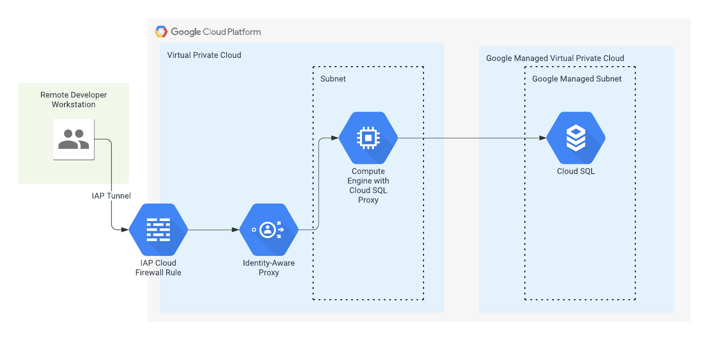

# cloud-sql-proxy


## Overview

A Terraform module that builds out a Compute Engine VM with the Cloud SQL Proxy installed as well as the required IAP configs to allow a developer to access a Cloud SQL database from their workstation :robot:



To connect to the Cloud SQL instance once the infrastructure has been applied you need to open a tunnel to the VM using the following example command:

`gcloud compute start-iap-tunnel cloudsqlproxy-695b 3306 --local-host-port=localhost:3306 --zone=australia-southeast1-c`

Replace the VM name and both ports with the relevant ports for your environment. 

The above example creates an IAP tunnel to the VM named `cloudsqlproxy-695b` on port `3306` using the local host port `3306`. The Cloud SQL proxy listens on whichever port is relevant to the database you're connecting to (in this example we're connecting to a MySQL Cloud SQL instance, so the Cloud SQL Proxy automatically listens on port `3306`).

## Assumptions

* You have a Cloud SQL instance already created
* You have a VPC network and subnetwork already created

## Troubleshooting

If you are having issues connecting to the Cloud SQL instance via the proxy, check the startup script logs on the VM to see if there are any errors. You can do this by running the following command on the instance:

`sudo journalctl -u google-startup-scripts.service`

<!-- BEGIN_TF_DOCS -->


## Example

```hcl
module "proxy" {
  source               = "git::https://github.com/withriley/cloud-sql-proxy.git"
  project              = "gcp-project"
  region               = "australia-southeast1"
  db_name              = "mysql-instance"
  network              = "vpc-network"
  subnetwork           = "vpc-subnet"
  create_firewall_rule = true
  additional_ports     = ["3306"]
  members              = ["user:peter.griffin@withriley.com"]
}
```

## Resources

| Name | Type |
|------|------|
| [google_compute_firewall.default](https://registry.terraform.io/providers/hashicorp/google/latest/docs/resources/compute_firewall) | resource |
| [google_compute_instance.default](https://registry.terraform.io/providers/hashicorp/google/latest/docs/resources/compute_instance) | resource |
| [google_iap_tunnel_instance_iam_binding.enable_iap](https://registry.terraform.io/providers/hashicorp/google/latest/docs/resources/iap_tunnel_instance_iam_binding) | resource |
| [google_project_iam_member.project](https://registry.terraform.io/providers/hashicorp/google/latest/docs/resources/project_iam_member) | resource |
| [google_project_service.default](https://registry.terraform.io/providers/hashicorp/google/latest/docs/resources/project_service) | resource |
| [google_service_account.default](https://registry.terraform.io/providers/hashicorp/google/latest/docs/resources/service_account) | resource |
| [random_id.default](https://registry.terraform.io/providers/hashicorp/random/latest/docs/resources/id) | resource |
| [random_shuffle.default](https://registry.terraform.io/providers/hashicorp/random/latest/docs/resources/shuffle) | resource |
| [google_compute_subnetwork.default](https://registry.terraform.io/providers/hashicorp/google/latest/docs/data-sources/compute_subnetwork) | data source |
| [google_compute_zones.available](https://registry.terraform.io/providers/hashicorp/google/latest/docs/data-sources/compute_zones) | data source |
| [google_sql_database_instance.default](https://registry.terraform.io/providers/hashicorp/google/latest/docs/data-sources/sql_database_instance) | data source |

## Modules

No modules.

## Inputs

| Name | Description | Type | Default | Required |
|------|-------------|------|---------|:--------:|
| <a name="input_additional_ports"></a> [additional\_ports](#input\_additional\_ports) | Additional ports to open for IAP tunnelling - only used if create\_firewall\_rule is true | `list(string)` | `[]` | no |
| <a name="input_create_firewall_rule"></a> [create\_firewall\_rule](#input\_create\_firewall\_rule) | Boolean to enable/disable firewall rule creation for IAP tunnelling | `bool` | `false` | no |
| <a name="input_db_name"></a> [db\_name](#input\_db\_name) | Cloud SQL instance database name | `string` | n/a | yes |
| <a name="input_host_project"></a> [host\_project](#input\_host\_project) | Project where the firewall rule + VM will be created if using Shared VPC - if not using Shared VPC leave blank | `string` | `""` | no |
| <a name="input_members"></a> [members](#input\_members) | List of the members to grant IAM permissions for IAP tunnelling. Format: user:<email>, group:<email>, etc. | `list(string)` | n/a | yes |
| <a name="input_network"></a> [network](#input\_network) | Name of the network | `string` | n/a | yes |
| <a name="input_project"></a> [project](#input\_project) | Project name where the resources are deployed | `string` | n/a | yes |
| <a name="input_region"></a> [region](#input\_region) | Region to deploy the resources to | `string` | n/a | yes |
| <a name="input_subnetwork"></a> [subnetwork](#input\_subnetwork) | Name of the subnetwork | `string` | n/a | yes |

## Outputs

No outputs.
<!-- END_TF_DOCS -->
